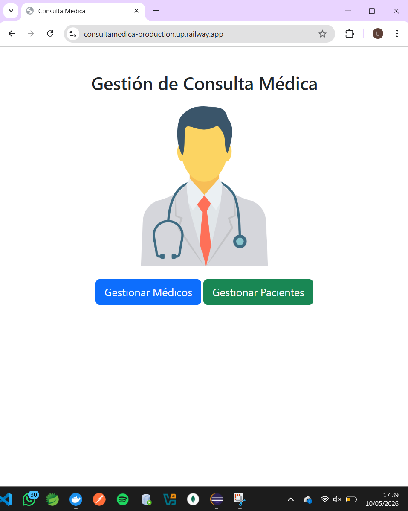
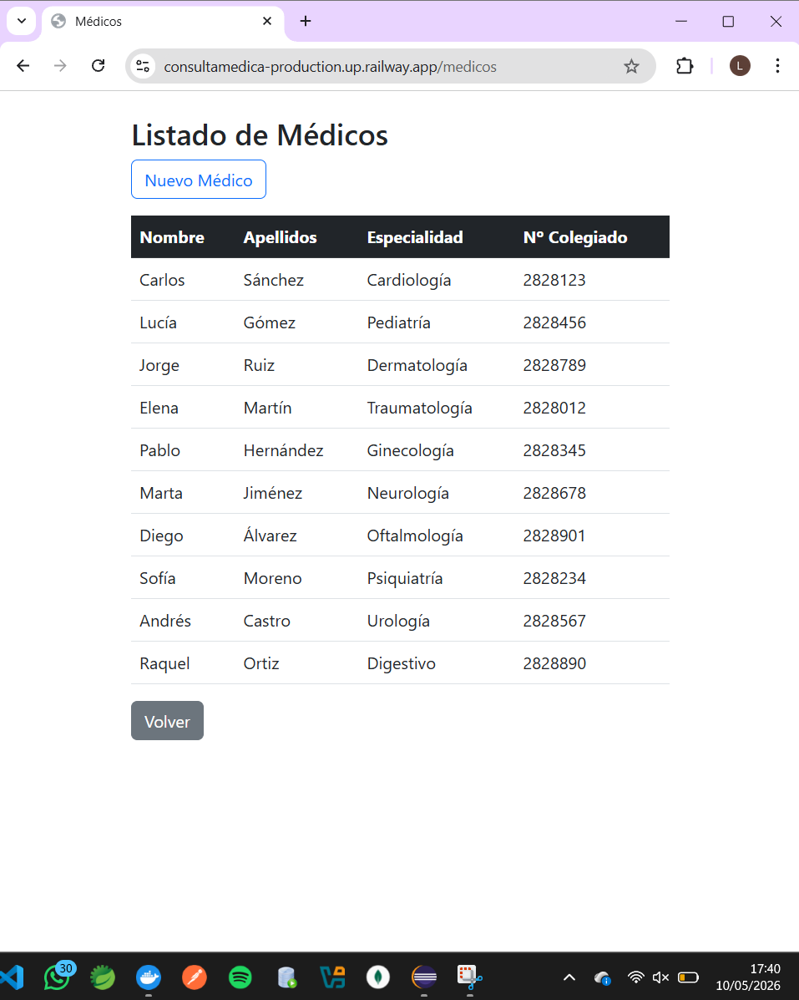
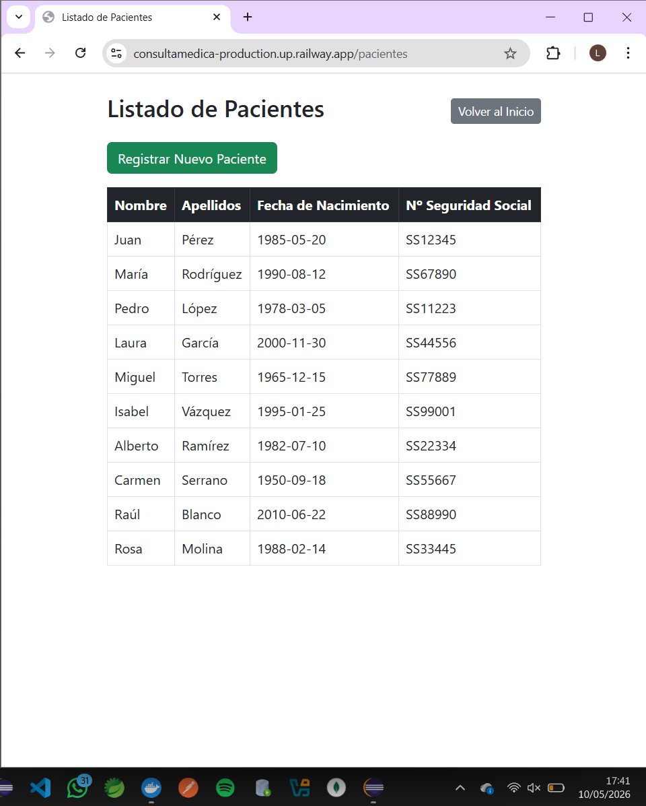
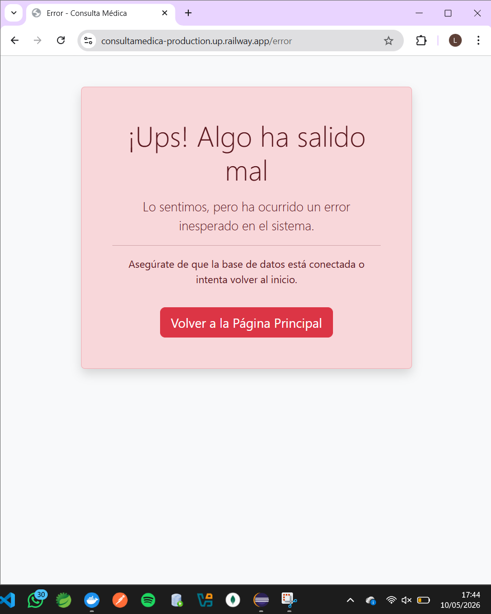

# Práctica UT8 — Sistema de Gestión de Consultas Médicas


## Descripción del Proyecto
Esta aplicación es una solución integral para la gestión de centros médicos, desarrollada como parte de la Práctica de la UT8 (JPA/Hibernate). El sistema permite la gestión administrativa de dos entidades principales bajo un modelo relacional:  
- Médicos: Gestión de profesionales con campos de nombre, apellidos, especialidad y experiencia.  
- Pacientes: Registro de usuarios con datos identificativos e historial clínico.  

La aplicación incluye la creación automática del esquema, carga inicial de 10 registros por entidad mediante CommandLineRunner en el arranque y una página de error personalizada (error.html).

🌐 **URL del Proyecto en Railway:** [https://consultamedica-production.up.railway.app/](https://consultamedica-production.up.railway.app/)

---

## Arquitectura del Sistema

La aplicación sigue el patrón de diseño **MVC (Modelo-Vista-Controlador)** para garantizar una separación de responsabilidades clara:

* **Capa de Modelo (Entities):** Mapeo objeto-relacional mediante JPA para las tablas `Medico` y `Paciente`.
* **Capa de Persistencia (Repositories):** Uso de `JpaRepository` para operaciones CRUD optimizadas sin SQL manual.
* **Capa de Control (Controllers):** Gestión de rutas y lógica de negocio para la comunicación entre el cliente y el servidor.
* **Capa de Vista:** Plantillas dinámicas renderizadas con **Thymeleaf**.

---

## Modelo de Datos (JPA Entities)

### Entidad: Médico
Gestiona la información profesional de los doctores:
* `id`: Identificador único (Auto-increment).
* `nombre` y `apellidos`: Información personal.
* `especialidad`: Área médica del profesional.
* `experiencia`: Años de ejercicio (validación numérica).

### Entidad: Paciente
Gestiona el registro de usuarios del centro:
* `id`: Identificador único.
* `nombre` y `apellidos`: Datos de identificación.
* `historial`: Resumen breve de la ficha médica.

---

## Capturas de Pantalla

Página de Inicio (/inicio) 

Listado de Médicos - Tabla con todos los registros de la entidad Médicos.  

Listado de Pacientes - Tabla con todos los registros de la entidad Pacientes. 

Página de error 

---

## Configuración y Despliegue

### Requisitos Técnicos
* **JDK:** 17
* **Maven:** 3.8+
* **Base de Datos:** MySQL 8.0 o superior.

### Pasos para la Ejecución Local
Para poner en marcha la aplicación en su entorno de desarrollo, siga estrictamente este orden de operaciones detallado en la documentación de la práctica:

##1. Clonar el repositorio
- git clone https://github.com/rloorenaa/ConsultaMedica.git
- cd ConsultaMedica

##2. Ejecutar el script SQLEs obligatorio preparar la persistencia antes de arrancar el servidor: 
- Localice el archivo schema.sql en la raíz del proyecto. 
- Ejecute el script en su cliente MySQL para crear la base de datos virtuallab y las tablas necesarias.  
- Asegúrese de utilizar un usuario con permisos de escritura.

##3. Configurar application.properties
- Abra el archivo src/main/resources/application.properties
- Modifique las siguientes líneas con sus credenciales personales:

```properties
# Configuración de Conexión
spring.datasource.url=jdbc:mysql://localhost:3306/virtuallab
spring.datasource.username=tu_usuario
spring.datasource.password=tu_contraseña

# Estrategia de Hibernate
spring.jpa.hibernate.ddl-auto=update
spring.jpa.show-sql=true
